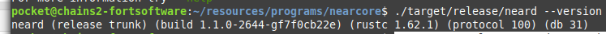

# Challenge 5

## Near CLI setup.

1. Installed NodeJS in the system.
    ```
    curl -sL https://deb.nodesource.com/setup_18.x | sudo -E bash -  
    sudo apt install build-essential nodejs
    PATH="$PATH"
    ```
2. Installed the Near CLI
   `sudo npm install -g near-cli`
3. Set up the NEAR_ENV=shardnet env variable in the .profile file so that it picks it up whenever I log in to the system. Otherwise, 
it will use the default (`testnet`).
    ```
    echo 'export NEAR_ENV=shardnet' >> ~/.profile
    source $HOME/.profile
    ```

## VPS/System Selection
At the time of writing, the required system specs were:

| Hardware | Chunk-Only Producer Specifications |
|----------|------------------------------------|
| CPU      | 4-Core CPU with AVX support        |
| RAM      | 8GB DDR4                           |
| Storage  | 500GB SSD                          |

Originally I was planning to run the near validator node on a **VPS 6000 G10** that I had rented on Netcup. However,
it is stated on the instructions that the system must have the features checked by the following command.
```
lscpu | grep -P '(?=.*avx )(?=.*sse4.2 )(?=.*cx16 )(?=.*popcnt )' > /dev/null \
  && echo "Supported" \
  || echo "Not supported"
```
At the time of writing, the VPS 6000 G10 fails the check (at least on my system), therefore, I ended up choosing an 
AX 101 system from Hetzner https://www.hetzner.com/dedicated-rootserver/ax101. This is an overkill, but since I expect
to run other unrelated processes on the system, I decided to go with it. This one passes all the checks.

The system has **Debian 11** operating system.

## VPS/System setup

I ended up installing all the dependencies listed in the instructions

1. Developer tools: `sudo apt install -y git binutils-dev libcurl4-openssl-dev zlib1g-dev libdw-dev libiberty-dev cmake gcc g++ python3 docker.io protobuf-compiler libssl-dev pkg-config clang llvm cargo`
2. Python/pip: `sudo apt install python3-pip`
3. Set the following env variable:
    ```
    USER_BASE_BIN=$(python3 -m site --user-base)/bin
    export PATH="$USER_BASE_BIN:$PATH"
    ```
4. Installed the building tools `sudo apt install clang build-essential make`
5. Installed rust/cargo via rustup
    ```
    curl --proto '=https' --tlsv1.2 -sSf https://sh.rustup.rs | sh
    ```
    **Note:** In this step, the rustup installer complains that I already have rust/cargo and that it is not recommended to install
    rustup alongside an already existing installation of rust/cargo. I assume this is because the first command in this list 
    tells me to install cargo. I decided to ignore the warning and went ahead and installed rustup and did not have any issues 
    along the way. **Disclaimer:** I have 0 experience with Rust.
6. I loaded the rust/cargo envs: `source $HOME/.cargo/env`

## Building the binary

1. Fetched the source code
    ```
    git clone https://github.com/near/nearcore
    cd nearcore
    git fetch
    ```
2. Checked out the specified commit as described in the instructions. At the time of writing it was one that I do not
    remember because there were a recent update and I updated to this commit `f7f0cb22e85e9c781a9c71df7dcb17f507ff6fde`
    as per the instructions. So I did `git checkout f7f0cb22e85e9c781a9c71df7dcb17f507ff6fde`
3. Build the binary: `cargo build -p neard --release --features shardnet`
4. The binary will be ready at `path/to/repo/target/release/neard`. As a sanity check, I ran the command to get the binary version:
    

## neard environemnt setup

1. Initialized the working directory. `./target/release/neard --home /data0/near init --chain-id shardnet --download-genesis`
   In my case, I set up **/data0/near** as the home dir for the near service.
2. Replaced the default **/data0/near/config.json** file with the one at the following location
    `wget -O ~/.near/config.json https://s3-us-west-1.amazonaws.com/build.nearprotocol.com/nearcore-deploy/shardnet/config.json`

## Setting up as systemd service

1. In my case, I used a custom location (`/data0/near`) to put up the config file and the blockchain db, so my **near.service** file looks like:
    ```
    [Unit]
    Description=NEARd Daemon Service
    
    [Service]
    Type=simple
    User=pocket
    #Group=near
    WorkingDirectory=/data0/near
    ExecStart=/path/to/nearcore/target/release/neard --home /data0/near run
    Restart=on-failure
    RestartSec=30
    KillSignal=SIGINT
    TimeoutStopSec=45
    KillMode=mixed
    
    [Install]
    WantedBy=multi-user.target
    ```
2. I added the service file to the `/etc/systemd/system/` dir.
3. Before running the service, I modified the peers config a little because the default used too much bandwidth.
    ```
      "network": {
        "addr": "0.0.0.0:24567",
        "whitelist_nodes": "",
        "max_num_peers": 10,
        "minimum_outbound_peers": 5,
        "ideal_connections_lo": 1,
        "ideal_connections_hi": 5,
        ...
    ```

## Preparing the validation_key.json file for the node.

I decided to call my pool **fortsoftware.factory.shardnet.near**. Before setting everything up, I already had an account
**fortsofware.shardnet.near** with 550 shardnet near. Based on this I created the staking pool as follows:

1. Generated the key file: `near generate-key fortsoftware.factory.shardnet.near`
2. Moved the generated file to the node home dir: `mv ~/.near-creadentials/shardnet/fortsoftware.factory.shardnet.near.json /data0/near/validator_key.json`
3. Opened the **validator_key.json** file and renamed the property `private_key` to `secret_key`.
4. Now I went ahead and started the service: `sudo service near start`.

## Creating the staking pool

In my case, my shardnet account is **fortsoftware.shardnet.near** and the pool id I am going to use to create my account
is **fortsoftware.factory.shardnet.near**. Based on these details, I proceeded to create the staking pool as follows:

1. In order to interact with the contracts to create the staking pool, I need to log in with the account that will pay the fees. In my case, it will also be the owner of the pool:
    * I executed the CLI command `near login` and followed the instructions to log in with `fortsoftware.shardnet.near`.
2. Call the contract to create the pool: `near call factory.shardnet.near create_staking_pool '{"staking_pool_id": "fortsoftware", "owner_id": "fortsoftware.shardnet.near", "stake_public_key": "ed25519:C2Hd7sX5fPMAHEWKWS6YUaBBJ7gMBndWTzdfAHtZ2RJv", "reward_fee_fraction": {"numerator": 5, "denominator": 100}, "code_hash":"DD428g9eqLL8fWUxv8QSpVFzyHi1Qd16P8ephYCTmMSZ"}' --accountId="fortsoftware.shardnet.near" --amount=30 --gas=300000000000000`
    The public key for my staking pool is `ed25519:C2Hd7sX5fPMAHEWKWS6YUaBBJ7gMBndWTzdfAHtZ2RJv`
3. Later on, I modified reward fee fraction to 1 with the following call: `near call fortsoftware.factory.shardnet.near update_reward_fee_fraction '{"reward_fee_fraction": {"numerator": 1, "denominator": 100}}' --accountId fortsoftware.shardnet.near --gas=300000000000000`
4. Then I tested the ping command `near call fortsoftware.factory.shardnet.near ping '{}' --accountId fortsoftware.shardnet.near --gas=300000000000000` 

## Monitoring the staking pool

The state of my staking pool at the moment of writing is the following:

1. [RPC Version](./images/neard-version-curl.png)
2. [Staking pool accounts](./images/view-accounts-stakingpool.png)
3. Due to the ever-increasing seat price for becoming a validator, my node has not produced any blocks and has not been
    kicked from a validator seat. It has only reached the proposer stage.